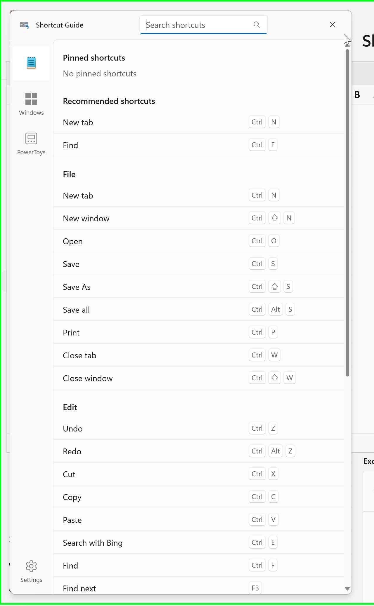
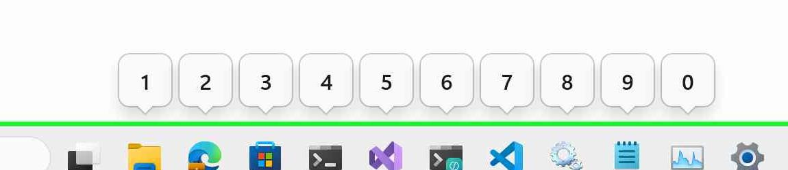
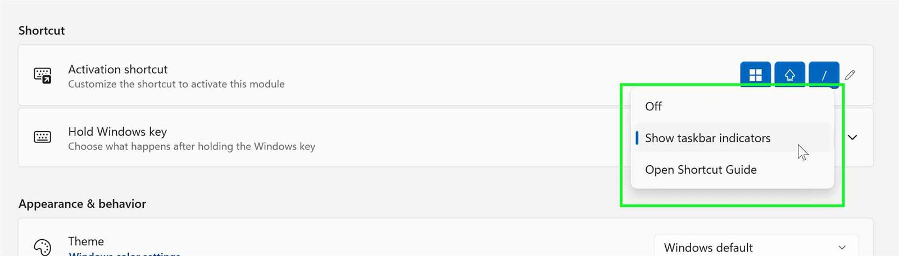
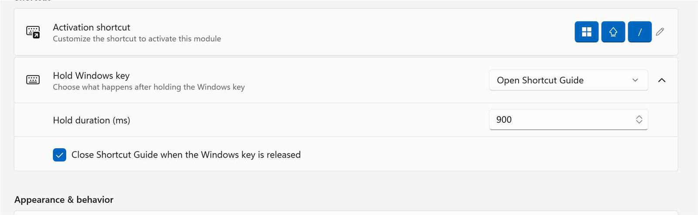
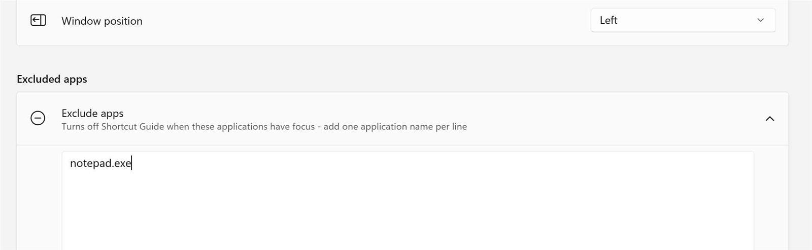

# Shortcut Guide - visual reference

Use these cropped Steps Recorder images with the main profile's
[lifecycle map](../shortcut-guide.md#ui-state-transition-map). They identify controls and rendered
states, not timing or behavior, and are not pixel baselines. Green borders are recorder annotations;
missing frames do not prove a state never occurred.

## Full guide

Application rail, search, Close, Pinned, Recommended, headings, and key caps. The top rail item
represents the captured foreground app; Windows and PowerToys remain available.

## Taskbar indicators

Callouts `1` through `0` above app buttons. Observe hold/release and routing live.

## Windows-key action

**Off**, **Show taskbar indicators**, and **Open Shortcut Guide**.

## Full-guide hold controls

Duration and close-on-release. The pictured duration is not a default.

## Excluded applications

One executable name per line. This image shows configuration, not suppression.
Search results, pin menus, page switching, close animation, and launcher integration need live evidence.
