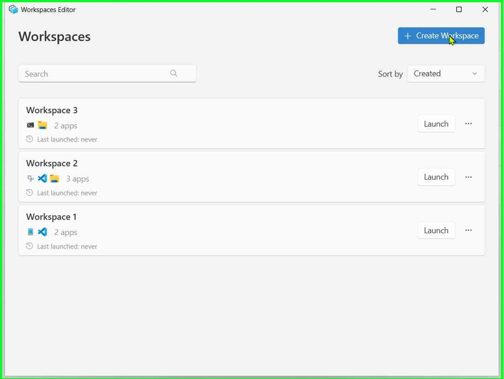
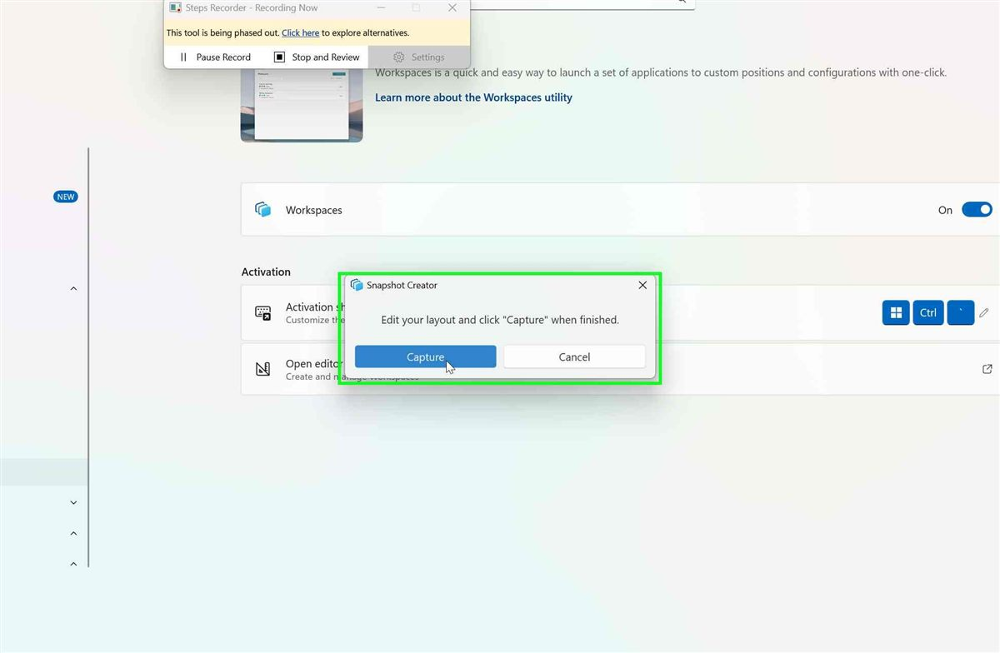
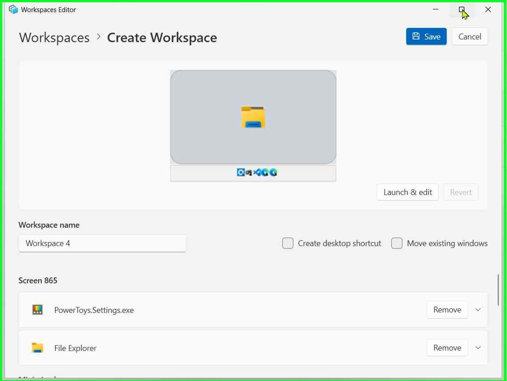
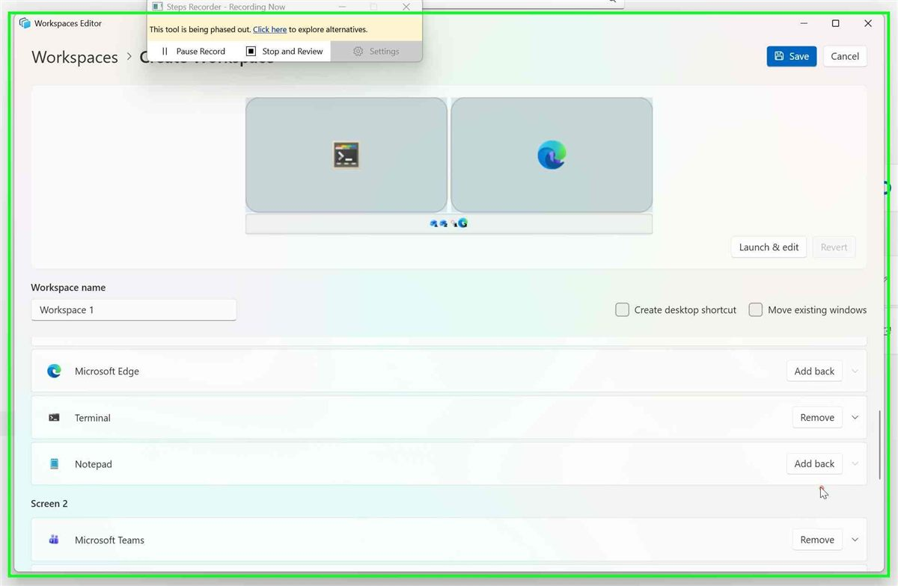
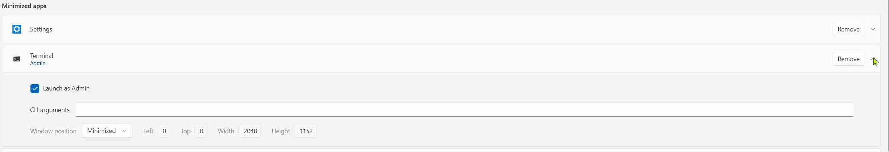
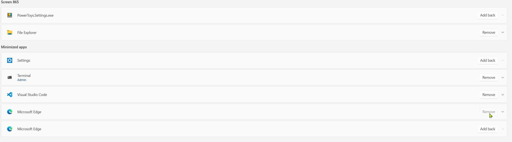
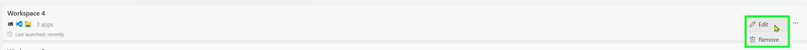
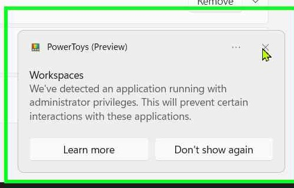

# Workspaces — module verification profile

| Bootstrap fact | Value |
|---|---|
| PT module | `Workspaces` — capture, edit, and relaunch groups of positioned application windows |
| Source | `src\modules\Workspaces\` |
| Settings | `%LOCALAPPDATA%\Microsoft\PowerToys\Workspaces\settings.json` |
| Workspace data | `%LOCALAPPDATA%\Microsoft\PowerToys\Workspaces\workspaces.json` |
| Editor | `PowerToys.WorkspacesEditor.exe` · UIA app ID `PowerToys.WorkspacesEditor` |
| Launcher UI | `PowerToys.WorkspacesLauncherUI.exe` · UIA app ID `PowerToys.WorkspacesLauncherUI` |
| Default hotkey | <kbd>Win</kbd> + <kbd>Ctrl</kbd> + <kbd>Backtick (&#96;)</kbd> · `properties.hotkey.value` |
| Named Events | `Workspaces.LaunchEditor` · `Workspaces.Hotkey` |
| Last verified | `0.101.2222.0` · 2026-08-12 |

## UI state-transition map

The screenshots are cropped module-only frames from a human recording. Use them as
UI-state landmarks for locating controls, not pixel baselines.

| Current state | Trigger / control | Next state | Observable side effect |
|---|---|---|---|
| Settings, Quick Access, or no editor | `Workspaces.LaunchEditor`, **Open editor**, Quick Access, or the configured hotkey | Workspace list | One `PowerToys.WorkspacesEditor` window is present |
| Workspace list | `NewProjectButton` | Snapshot Creator | Editor minimizes; one capture overlay appears per monitor |
| Snapshot Creator | `SnapshotButton` | Editing page with a new draft | Current visible windows are grouped by monitor; minimized windows use a separate group |
| Snapshot Creator | `CancelButton` | Workspace list | Overlays close; workspace count and persisted data remain unchanged |
| Workspace list | card `DataItem` or More → `Edit` | Editing page for the selected workspace | Name, applications, launch properties, and preview load from the selected project |
| Workspace list | card More → `Remove` | Workspace list without the selected workspace | Card is absent and its workspace ID is absent from `workspaces.json` |
| Editing page | `Save` | Workspace list | Draft is written to `workspaces.json`; shortcut state is reconciled |
| Editing page | `Cancel` or breadcrumb `Workspaces` | Workspace list | Unsaved draft changes are discarded |
| Editing page | `LaunchEditButton` | Snapshot Creator after apps launch | Current project launches, then the live desktop becomes the recapture input |
| Recapture Snapshot Creator | `SnapshotButton` | Editing page with recaptured draft | Newly visible apps can be added; `RevertButton` becomes available |
| Recaptured editing page | `RevertButton` | Editing page with pre-recapture draft | Recapture changes are discarded without leaving the editor |
| Workspace list, desktop shortcut, or Command Palette result | card `Launch`, `.lnk`, or result invocation | Launcher UI, then completed launch | Configured apps report progress and are started or matched/moved |
| Launcher UI | `CancelButton`, `DismissButton`, or natural completion | Launcher closed | Cancel stops pending launch work; dismissal or completion retains successfully started or matched app windows |

Use the transition table to choose the next control and assertion. Use the screenshots
below only to recognize the corresponding state when UIA is incomplete.

### Run-cleanup postconditions

Keep verifier cleanup out of the product UI map. End every run in a **Baseline restored**
state with these assertions:

- Delete any generated desktop shortcut and reopen the editor to confirm its checkbox is off.
- Restore the runner to its pre-flight integrity level after elevated capture cases.
- Restore the original Workspaces settings, workspace data, and Windows theme; compare their
  values or hashes with the pre-flight backups.
- Close only test-created windows and processes by their tracked HWNDs, PIDs, and start times;
  preserve pre-existing user windows.

The focused crops below come from `Recording_20260813_1630-export` and intentionally
remove the Steps Recorder toolbar, taskbar, and unrelated page regions. Steps Recorder
outlines the control used in the recorded action with a green border; treat that border
as action metadata, not product UI.

### Workspace list

Landmarks: **Create Workspace**, Search, Sort, and workspace cards. An empty list is valid.

### Snapshot Creator

Landmarks: the topmost **Capture** / **Cancel** dialog and one overlay per monitor.

### Captured-layout editor

Landmarks: monitor preview, project properties, **Screen N** groups, and expandable app rows.

### Removed and minimized applications

Landmarks: excluded rows show **Add back**; minimized rows use **Minimized apps**.

#### Focus: expanded minimized-app launch properties

Recording step 11 landmarks: the Terminal row is under **Minimized apps**;
**Launch as Admin** is checked; `Admin` appears under the app name; **CLI arguments**
and **Window position = Minimized** are visible. Use this to recognize expansion,
admin-state persistence, and minimized-position state together.

#### Focus: removed rows and Add back

Recording step 16 landmarks: excluded apps show **Add back** while retained apps show
**Remove**. The crop contains examples in both the screen section and **Minimized apps**,
so target the intended row by app name rather than the first matching button.

### Workspace card More popup

Recording step 21 landmarks: the card overflow popup exposes **Edit** and **Remove**.
Recognize this state before invoking either action. The green border is the recorder's
click marker.

### Elevated-application warning

Recording step 13 landmarks: the PowerToys notification names **Workspaces**, explains
that an administrator-privilege application prevents certain interactions, and exposes
**Learn more** / **Don't show again**. It is not a failed save.

The supplied recording does not include Workspaces Launcher progress/completion/error
states or Command Palette Workspaces results. Do not infer those states from these
images. Capture focused landmarks in a separate recording when those surfaces are
available.

## Entry-paths (try in order)

### 1. Named Event

Use `Invoke-PtSharedEvent -Name 'Workspaces.LaunchEditor'` to open the editor without
foreground input. Use `Workspaces.Hotkey` only for the downstream hotkey action; use real
SendInput when the shortcut binding itself is under test.

### 2. Settings

Open Settings → Workspaces and invoke `WorkspacesLaunchEditorButtonControl`. The shipped
button label is **Open editor**. The enable switch is a `ToggleSwitch` named `Workspaces`.

### 3. Quick Access

Quick Access has a stunted UIA tree. Keyboard focus starts on **More**; tab eight times to
Workspaces and press Enter. Prefer keyboard navigation over coordinate clicking.

### 4. Workspace card and desktop shortcut

Invoke a card's **Launch** button, invoke its generated `.lnk`, or invoke the corresponding
Command Palette result. Use the editor's Launch button when validating the **Last launched**
timestamp.

## Control locator and interaction index

Use the state-transition map for navigation order, preconditions, expected next states, and
assertions. After reaching the required state, use this index to locate controls that modify
or inspect that state. Navigation controls already named in the transition map are intentionally
not repeated here.

| Interaction | Preferred locator / drive |
|---|---|
| Search workspace or application names | `SearchTextBox` |
| Change and persist sorting | discover the list-page `ComboBox`; select Name, Created, or Last launched |
| Add/remove applications | row `Remove`; removed-row `Add back` |
| Edit launch properties | `CommandLineTextBox`; `LeftTextBox`; `TopTextBox`; `WidthTextBox`; `HeightTextBox`; `Launch as Admin` |
| Change window state | row `ComboBox` values Custom, Maximized, Minimized |
| Create desktop shortcut | checkbox named `Create desktop shortcut` |
| Move matching windows | checkbox named `Move existing windows` |
| Command Palette integration | query Workspaces or the workspace name in `MainSearchBox` |
| Theme behavior | reopen editor and launcher after changing the Windows app theme/high contrast state |

### Read-out notes

- Persisted values are read from `workspaces.json`; always restore the original file or delete
  only disposable cards through the UI.
- Screenshots of the editing page preview provide the most reliable read-out for custom,
  maximized, and minimized states.
- Launcher rows are virtualized. Capture the launcher immediately after invoking a workspace,
  then inspect again after completion.
- The Command Palette workspace result shows the application count and last-launched state.

## BLOCKED traps

- **Virtualized WPF children disappear from UIA.** Application rows and card actions may be
  visible but absent from `search`. Invoke/click the row `DataItem`, scroll it into view, then
  inspect again. The unnamed card ellipsis may require a DPI-aware coordinate click; its popup
  is a separate owned HWND whose `Edit` and `Remove` buttons are UIA-invokable.
- **Window-state ComboBox popup is a separate HWND.** Click the popup `ListItem`, or focus the
  ComboBox and use Up/Down + Enter. `invoke` on the visual item is less reliable.
- **DPI mapping matters for fallback clicks.** UIA/screenshot coordinates are physical while an
  unware PowerShell host can receive virtualized coordinates. Divide the complete absolute
  coordinate by `GetDpiForWindow(hwnd) / 96`, not only the element-relative offset.
- **Snapshot visibility follows integrity level.** A non-elevated editor omits elevated windows.
  Restart PowerToys elevated to verify inclusion and the checked **Launch as Admin** state, then
  restart it with the Explorer medium token before cleanup.
- **Launch & edit captures every visible window.** Close disposable duplicate windows and avoid
  unrelated multi-window apps before asserting that existing entries remain represented once.
- **Clean-profile first-render coverage is destructive** (`BLK-DESTRUCTIVE`). Mixed-DPI and
  monitor-topology coverage needs the stated displays (`BLK-HARDWARE`). PWA coverage needs a
  suitable installed non-default-profile PWA (`BLK-EXTERNAL-APP`).
- **UAC consent is on the secure desktop.** If the test requires approving a prompt and no human
  is present, classify that path `BLK-ENV`; do not synthesize input toward an unknown foreground.
- **Detached RDP input can occur mid-run.** Continue UIA invoke/set-value and targeted
  PostMessage checks, but stop SendInput and coordinate fallbacks when `GetForegroundWindow()`
  returns zero.

## Fixtures

- Use isolated fixtures that create identifiable windows: Notepad with a unique temp file,
  Calculator, Paint, or Terminal with a unique title/argument. Do not use the user's existing
  VS Code or browser profile, ODBC dialogs, or Control Panel pages for general cases; they reuse
  shared processes or create detached windows that cannot be attributed safely.
- Record each PID returned by the fixture launch. For a packaged app, resolve and record its
  exact PID/HWND immediately from its unique title. In `finally`, close only those recorded
  processes. Use `scripts/pt-workspaces-fixtures.ps1`, which is loaded by the standard
  bootstrap:
  - `New-PtWorkspacesFixtureSession` creates a per-case tracker.
  - `Start-PtWorkspacesNotepadFixture` creates and registers a unique Notepad fixture.
  - `Add-PtWorkspacesFixtureProcess` registers another exact PID, including its start time.
  - `Add-PtWorkspacesFixtureFile` registers an exact disposable file.
  - `Stop-PtWorkspacesFixtureSession` gracefully closes tracked windows, terminates only
    exact surviving processes, and removes registered files. Always call it in `finally`.
  The helper refuses pre-existing PIDs, and the Notepad fixture refuses to launch while a
  user-owned Notepad process is already running.

- Run cleanup after **each case**, not only at final wrap-up. Track any desktop shortcut,
  temp file, workspace card, and launcher/editor HWND created by that case in the same
  `finally` block.
- A PWA case must use a disposable browser profile/user-data directory and close that
  profile's tracked process tree afterward.
- One unpackaged window and one packaged window at visibly different rectangles.
- One minimized window and one maximized window.
- One elevated Win32/PowerShell window for integrity-level capture.
- A unique file path for command-line argument verification.
- Enough disposable workspaces and application rows to force both list and editing-page scrolling.

## Source citations

- `Workspaces.ModuleServices\WorkspaceService.cs` — `LaunchEditorAsync` signals the launch event.
- `WorkspacesEditor\SnapshotWindow.xaml` and `.xaml.cs` — snapshot Capture/Cancel controls.
- `WorkspacesEditor\WorkspacesEditorPage.xaml` and `.xaml.cs` — edit controls and Launch & edit.
- `WorkspacesEditor\ViewModels\MainViewModel.cs` — save/edit project state.
- `WorkspacesEditor\Models\Project.cs` `ApplicationsListed` — monitor and minimized grouping.
- `WorkspacesEditorUITest\WorkspacesEditingPageTests.cs` `TestRemoveAndAddBackApp` — app exclusion and restore behavior.
- `WorkspacesSnapshotTool\Resource.resx` `System_Foreground_Elevated` — elevated-app warning.
- `WorkspacesCsharpLibrary\Data\WorkspacesStorage.cs` — persisted project properties.
