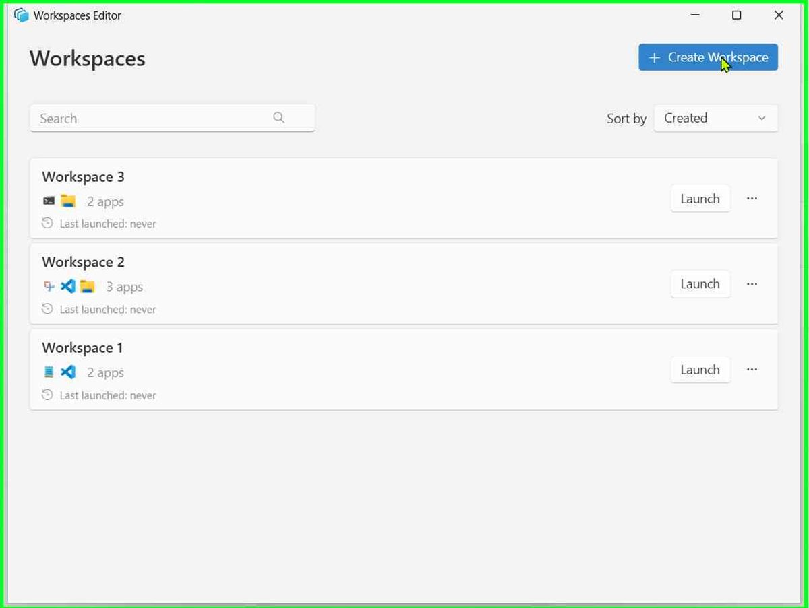
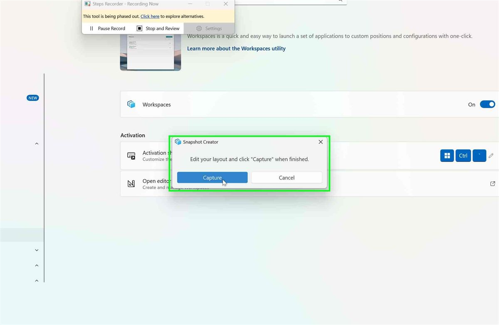
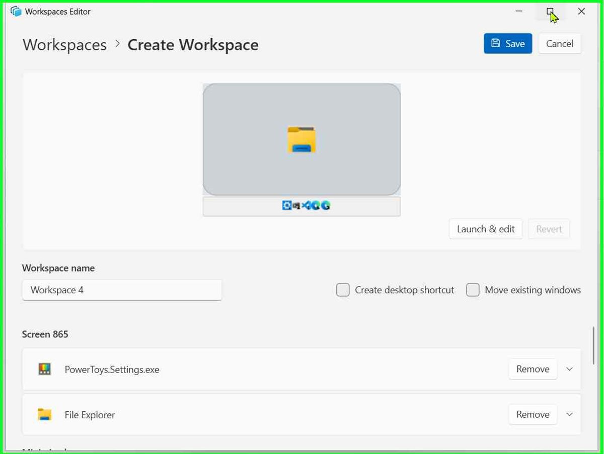
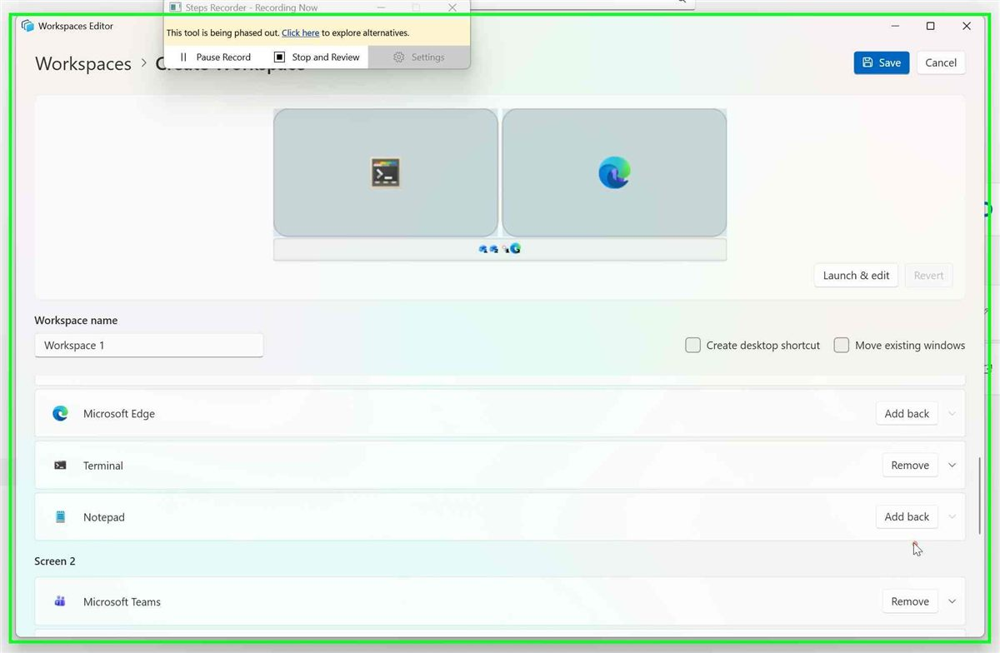
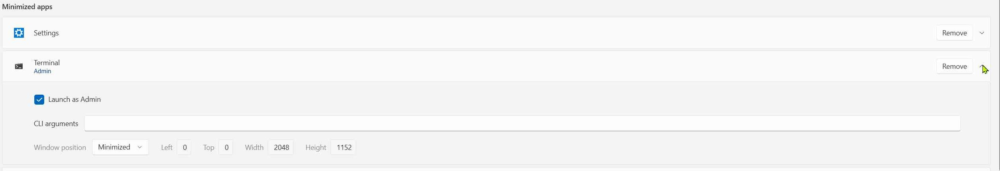
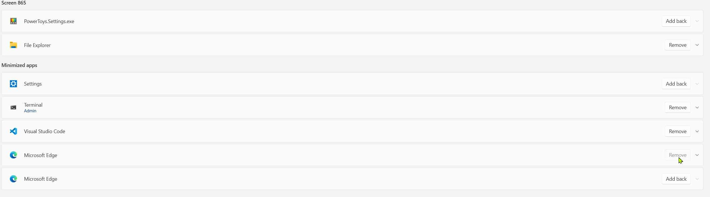
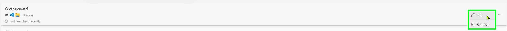
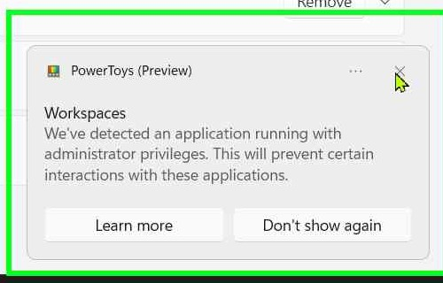

# Workspaces — module verification profile

## Module facts

| Bootstrap fact | Value |
|---|---|
| PT module | `Workspaces` — capture, edit, and relaunch groups of positioned application windows |
| Source | `src\modules\Workspaces\` |
| Settings | `%LOCALAPPDATA%\Microsoft\PowerToys\Workspaces\settings.json` |
| Workspace data | `%LOCALAPPDATA%\Microsoft\PowerToys\Workspaces\workspaces.json` |
| Editor | `PowerToys.WorkspacesEditor.exe` · UIA app ID `PowerToys.WorkspacesEditor` |
| Launcher UI | `PowerToys.WorkspacesLauncherUI.exe` · UIA app ID `PowerToys.WorkspacesLauncherUI` |
| Default hotkey | <kbd>Win</kbd> + <kbd>Ctrl</kbd> + <kbd>Backtick (&#96;)</kbd> · `properties.hotkey.value` |
| Named Events | `Workspaces.LaunchEditor` · `Workspaces.Hotkey` |
| Last verified | `0.101.2222.0` · 2026-08-12 |

**Assertion inventory**: [frozen Workspaces scenario/child mapping](../assertion-inventories/workspaces.json);
load it with the [shared inventory contract](../assertion-inventories/README.md), not run-local regrouping.
Run through the common template with the [mandatory resource wiring](../session-safety.md#mandatory-wiring-for-aligned-module-runs);
old report-local bootstraps are not the current run entry.

## Entry paths

Choose the entry path that exercises the requested behavior. These are alternatives,
not a fixed execution order.
Before creating fixtures or launching a workspace, establish the ownership and baseline
in [Fixtures and restoration](#fixtures-and-restoration).

### 1. Named Event

Use `Invoke-PtSharedEvent -Name 'Workspaces.LaunchEditor'` to open the editor without
foreground input. Use `Workspaces.Hotkey` only for the downstream hotkey action; use real
SendInput when the shortcut binding itself is under test.

### 2. Settings

Open Settings → Workspaces and invoke `WorkspacesLaunchEditorButtonControl`. The shipped
button label is **Open editor**. The enable switch is a `ToggleSwitch` named `Workspaces`.
If the SettingsCard rejects InvokePattern, first make the whole card visible, then use
an exact-HWND guarded `winapp ui click` on that selector. A partially clipped card can
report nonzero bounds without exposing a usable action pattern.

### 3. Quick Access

Quick Access has a stunted UIA tree. Keyboard focus starts on **More**; tab eight times to
Workspaces and press Enter. Prefer keyboard navigation over coordinate clicking.

### 4. Workspace card and desktop shortcut

Invoke a card's **Launch** button, invoke its generated `.lnk`, or invoke the corresponding
Command Palette result. Use the editor's Launch button when validating the **Last launched**
timestamp.

## UI state-transition map

Read this as a state-to-actions index, not a fixed test sequence. Find the current state,
then choose a row whose trigger and condition apply. Each row has one destination;
the landmarks identify that surface, not whether the test passed. Editor and launcher
windows can coexist: these are surface-scoped states, not one global process state.
`Editor closed` and `Launcher closed` refer only to their respective tracked windows.

| Current state | Trigger / condition | Next state | State landmarks |
|---|---|---|---|
| Editor closed | Select an authorized editor entry path from the section above | Workspace list | Editor HWND with `SearchTextBox` and `NewProjectButton`; cards or the empty-list message |
| Workspace list | `NewProjectButton` | Snapshot Creator (new workspace) | Capture/Cancel dialog and monitor overlays; editor minimized |
| Workspace list | Target card's edit action or More → **Edit** | Editing draft | `EditNameTextBox`, application-list region, preview, `SaveButton` and `CancelButton` |
| Workspace list | Target card's More → **Remove** | Workspace list | List/search/create controls remain available; not a distinct screen per card count |
| Workspace list | Target card's **Launch**; no launch already in progress | Launcher UI | Separate `PowerToys.WorkspacesLauncherUI` status window with application progress and Cancel/Dismiss |
| Snapshot Creator (new workspace) | `SnapshotButton`; capture returns a draft | Editing draft | Editor restored with draft name, application list and preview |
| Snapshot Creator (new workspace) | Dialog `CancelButton` or close | Workspace list | Capture surfaces gone; originating list page visible again |
| Editing draft | `SaveButton`, when enabled | Workspace list | Editor's list/search/create controls |
| Editing draft | `CancelButton` or **Workspaces** breadcrumb | Workspace list | Same list landmarks; reaching this page alone does not distinguish Save from Cancel |
| Editing draft | `LaunchEditButton` | Launch & edit pending | Tracked native launcher operation; do not assume the capture dialog is ready yet |
| Editing draft | `RevertButton`, when enabled after recapture | Editing draft | Editor/preview stay open; availability of Revert is read from the current draft |
| Launch & edit pending | Native launcher process finishes | Snapshot Creator (recapture) | Capture/Cancel dialog and overlays; editor minimized with its draft retained |
| Snapshot Creator (recapture) | `SnapshotButton`; capture returns a draft | Editing draft | Editor's application-list region and preview; enabled `RevertButton` |
| Snapshot Creator (recapture) | Dialog `CancelButton` or close | Editing draft | Capture surfaces gone; originating editing page visible again |
| Launcher closed | Owned workspace `.lnk` or actual Command Palette workspace command | Launcher UI | Tracked launcher status window; the editor need not be open |
| Launcher UI | Its `CancelButton` (sends cancellation) | Launcher closed | Tracked status window gone; inspect application/launch results separately |
| Launcher UI | Its `DismissButton` (closes the status window only) | Launcher closed | Same absent status window; this is not proof that pending launch work stopped |
| Launcher UI | Native launch operation completes and cleans up its UI | Launcher closed | Tracked status window gone; disappearance is not proof of a successful layout |

`Editing draft` includes new, existing and recaptured projects; the available controls
determine the applicable branch. Snapshot cancellation restores the originating page,
so cancelling recapture must not be treated as a return to the workspace list.
For Launch & edit, wait for the native launch operation, not merely dismissal of its
status window. Capture/launch failures do not authorize forcing the listed destination.

Use the [interaction index](#control-locator-and-interaction-index) for exact scoped
operations and the checklist/read-out notes for saved data, discarded changes, shortcuts
and actual application layout. Use the
[visual references](#visual-references) only to recognize the corresponding state when
UIA is incomplete. Restoration verification belongs to
[Fixtures and restoration](#fixtures-and-restoration), not the product UI map.

## Control locator and interaction index

Use the state-transition map to reach the required page, then use this index to find the
control and choose an interaction. Scope each lookup to the current window and page.
An **application row** means the intended app entry in the workspace editing page, not the
first matching control anywhere in the window. Scroll that row into view and expand it
before editing its launch properties.

The AutomationIds below are control identifiers, not input values. Match them with the
stated control type in a fresh UIA tree; match names in the active UI language. Application
expanders use the app name as their name/ID, which can repeat: disambiguate the intended
instance using the exposed repeat label and the owned fixture, not the first matching row.
Re-discover after navigation, removal or reordering. Test inputs and expected results
come from the checklist.

| Interaction | UI state & scope | Control locator | How to interact |
|---|---|---|---|
| Filter the workspace list | Editor HWND, workspace list | `ControlType=Edit`, `AutomationId=SearchTextBox` | Set the requested workspace/application query through ValuePattern; clear by setting empty text. The binding updates on text changes; no Enter is required. |
| Change workspace sorting | Editor HWND, workspace list | ComboBox beside the localized **Sort by** label; options **Last launched**, **Created**, **Name** | Open the ComboBox and select the requested option. For its separate WPF popup, click the resolved ListItem or use Up/Down + Enter with the ComboBox focused; do not assume InvokePattern selects it. |
| Remove an application or add it back | Editing page, target application row header | Header Button displaying **Remove** or **Add back**; its explicit UIA Name remains the localized **Remove** | Read the current inclusion/content state, then invoke the same button only if a change is required. Removal collapses/disables the row's editor, but this header button remains usable for Add back. |
| Set application CLI arguments | Editing page, included and expanded target application row | `ControlType=Edit`, `AutomationId=CommandLineTextBox` within that row | Set the requested argument string through ValuePattern. The TextChanged handler updates the draft; use the Save transition when persistence is required. |
| Choose the application's window state | Editing page, included and expanded target application row | Row's ComboBox beside **Window position**; **Custom**, **Maximized**, **Minimized** | Open and select the requested option using its realized popup ListItem, or focused Up/Down + Enter. Re-resolve the row if regrouping occurs; do not select another row's ComboBox. |
| Set custom window position and size | Editing page, expanded target application row with **Custom** selected | `ControlType=Edit`; row-local `LeftTextBox`, `TopTextBox`, `WidthTextBox`, `HeightTextBox` AutomationIds | Set the requested fields through ValuePattern. TextChanged updates the draft/preview; use Save for persistence. Do not force fields disabled by Maximized/Minimized. |
| Set application launch privilege | Editing page, included and expanded target application row | CheckBox named **Launch as Admin** | Read ToggleState and toggle only if it differs from the requested state. Respect `IsEnabled`; an actual elevated launch still requires the applicable authorization. |
| Configure a desktop shortcut | Editing page, workspace-level properties, outside application rows | CheckBox named **Create desktop shortcut** | Set the desired checked state, not an unconditional toggle; use the Save transition to apply the workspace draft. |
| Configure reuse of existing windows | Editing page, workspace-level properties, outside application rows | CheckBox named **Move existing windows** | Set the desired checked state and Save before launching the workspace. |
| Find a workspace in Command Palette | Current Command Palette HWND and PowerToys-extension results | `ControlType=Edit`, `AutomationId=MainSearchBox`; target workspace result | Set the workspace/module query and resolve the matching extension result. Do not confuse an app-search result with the Workspaces provider or use the editor's `SearchTextBox`. |
| Change the theme used by Workspaces | Authorized Windows app-theme/high-contrast fixture; editor and launcher tracked separately | External Windows theme controls, not a Workspaces-local selector | Capture the original Windows setting, change it through the authorized fixture, and follow the checklist's live-update or reopen path. Restore that setting afterward; do not substitute reopening for a live-update assertion. |

### Read-out notes

- Reading a changed input confirms the current draft, not persistence or launch behavior.
  Use Save and reopen for persistence checks; launch and observe the application when the
  checklist requires a startup effect.
- Wait for Save to return to the workspace list before closing the editor. Before a
  close-then-hotkey check, also wait for the old editor process to exit. UIA Invoke returning
  is not completion of the queued action; an immediate close can cancel Save, and an
  immediate reopen can race the single-instance check.
- Search matches workspace names or contained application names. Sorting is saved separately
  in Workspaces settings; restore the original sort choice as well as edited workspace data.
- Persisted values are read from `workspaces.json`; always restore the original file or delete
  only disposable cards through the UI.
- Screenshots of the editing page preview provide the most reliable read-out for custom,
  maximized, and minimized states.
- Launcher rows are virtualized. Capture the launcher immediately after invoking a workspace,
  then inspect again after completion.
- The Command Palette workspace result shows the application count and last-launched state.

## Troubleshooting

Preserve the original action and observations. Recovery must be authorized, preserve the
assertion's entry path and have a restoration plan; diagnostic recovery cannot erase an
earlier failure. These rows are diagnostic branches, not automatic verdicts. Apply the
[shared taxonomy](../../SKILL.md#step-3--classification-taxonomy) to the actual prerequisite,
observation or behavior failure, and continue independent eligible checks.

| Symptom / condition | Diagnose / recover | Interpretation boundary |
|---|---|---|
| Visible application row or card action is missing from UIA search | Confirm the page/HWND, realize the target row by scrolling/expanding, then inspect again using the [interaction index](#control-locator-and-interaction-index). Identify the actual expander/card; do not blindly invoke a generic `DataItem`. | Missing UIA exposure is not an absent application. Require a usable observation before judging its presence/count. |
| A visible WPF row still has no children after scoped inspect and native UIA enumeration | Preserve both observations. For an owned workspace only, a physical fallback may use freshly observed row bounds and a matching visible control as calibration. Bound the point to the actual window viewport, guard foreground and verify the root HWND at the point; list content bounds can extend below the window. Re-read the saved app set before any launch. | Do not infer child controls from a model-type DataItem name, toggle a row twice on retry, or launch a captured workspace containing unowned applications. |
| ComboBox or card More action is not found in the editor HWND | Discover the owned popup and its current controls. Use the documented popup selection/click or focused-keyboard route, checking the supported pattern rather than assuming Invoke selects an item. | A separate popup HWND or unsupported pattern is a locator/driver issue, not evidence that the product action failed. |
| Coordinate fallback clicks at the wrong location | Record current bounds/DPI and the input API's coordinate space. Prefer scoped UIA/selector operations or the [physical-coordinate helpers](../helper-workflow.md#discover-wait-and-invalidate); do not rescale their already-physical coordinates. | DIP sizing and screen-coordinate conversion are different operations. A DPI-unaware fallback needs its own verified conversion; blanket division by the window scale can misroute input. |
| An elevated fixture window is missing from capture | Compare the actual snapshot process and target integrity, window eligibility and snapshot logs. Use elevated capture only for an authorized inclusion variant, then restore original runner integrity. | `SnapshotUtils.GetApps` skips unreadable process paths and warns for an elevated target from a non-elevated snapshotter. Missing rows can have other filter causes; do not elevate to change the context of a non-elevated visibility assertion. |
| Launch & edit captures additional or apparently duplicate apps | Compare exact owned windows and instances with the desktop present at recapture. Close only disposable duplicates when setup permits; use repeat labels/identities to distinguish instances. | Recapture enumerates eligible desktop windows, not only apps belonging to the saved workspace. Do not close user windows or call every additional row a product duplicate. |
| Clean-profile first-render conditions cannot be established | Check authorization and availability of the checklist's clean installation **or clean user profile** before startup. Do not delete the current user's settings to manufacture the fixture. | This is not inherently destructive. Identify the actual missing prerequisite or unsafe setup, affecting only this variant; a later settled toggle does not prove first-render behavior. |
| Required monitor/DPI topology is unavailable | Inspect active displays and scale factors against the selected assertion; use the declared topology fixture only when available. | Record missing hardware for the affected variant, not the whole module. A single-monitor render does not cover mixed-DPI or disconnect/reconnect behavior. |
| Required PWA/profile fixture is unavailable | Confirm an eligible installed PWA, non-default profile and app identity, or prepare an authorized disposable fixture. | A missing external fixture is not evidence of incorrect Workspaces launching; a generic browser window is not an equivalent PWA result. |
| An eligible launch requires UAC consent that cannot be supplied | Record the actual secure-desktop/consent prerequisite and follow [pre-flight policy](../pre-flight.md); do not inject toward an unknown foreground or change the tested privilege silently. | Missing consent blocks that launch variant, not basic non-admin checks. A settings checkbox alone does not prove elevation. |
| Foreground/input desktop disappears during RDP use | Stop SendInput and coordinate actions; recheck the exact target and [session conditions](../environment-setup.md). Continue non-input-dependent work only if its driver and observations remain usable. | Named events, UIA or PostMessage cannot substitute for a physical binding/gesture assertion. Retain incomplete input evidence instead of assuming product inactivity. |
| CmdPal Workspaces commands or saved-workspace results are absent | Discover the actual PowerToys provider, effective module enablement/policy and current workspace data; retain query/provider/load evidence. See the command conditions below. | Expected disabled/empty-data absence is not a failure. Required availability can fail once its premises and observation are established; a driver/dependency obstacle needs its own reason, not an automatic BLOCKED verdict. |

Once the PowerToys provider is loaded, `WorkspacesModuleCommandProvider.BuildCommands`
adds Settings regardless of module enablement; effective enablement gates Open editor
and workspace entries. Per-workspace entries also require successfully loaded data with
nonblank IDs and names. An app-search result is not this provider. Do not infer effective
disablement solely from a missing/unreadable settings file; the provider's policy/settings
resolution and the observed command inventory must be considered.

## Fixtures and restoration

Use the [shared session contract](../session-safety.md) before mutation: borrow existing
Editor/Settings windows, record owned creations and declare cleanup dependencies. A close/reopen
assertion requires a genuinely owned launch, not replacement of the user's Editor. Preserve
unsupported UI state and unresolved cleanup resources explicitly in this run's report.

Prepare only resources required by the selected assertions. Before mutation, record ownership,
original existence/values and lifetime: **case-owned** or explicitly shared **run-owned**.
Keep the original run baseline across retries. Declare semantic or byte-exact file restoration
up front; restoring defaults or choosing a weaker comparison afterward is not restoration.

### Resource inventory

| Fixture / resource | When needed | Ownership & baseline | Cleanup / restore | Verification |
|---|---|---|---|---|
| Isolated application windows and temp files | Capture, launch, CLI arguments and layout | Owned Notepad/Calculator/Paint/Terminal fixtures with unique titles/arguments; record PID/start time/HWND and exact new paths | Use the fixture tracker below for owned processes/new files; never register a user window or existing file for deletion | Owned windows/processes and new files gone; pre-existing windows retained |
| Disposable PWA profile | Eligible PWA cases | Unique user-data directory and individually attributed process identities; no user's browser profile | Stop the proven owned processes, then remove only the declared disposable data; no process-name or implicit descendant cleanup | Owned profile artifacts gone; unrelated browser processes/data unchanged |
| Workspace cards and `workspaces.json` | Create/edit/remove/launch/recapture | Track workspace IDs, original records and whether each is new; retain the original file and known test-written state | Prefer deleting owned cards through the UI; restore changed pre-existing records/file only within the declared ownership and writer contract | New IDs absent; original workspace data matches the declared baseline |
| Desktop `.lnk` and `WorkspacesIcons\<workspace-id>.ico` | Shortcut creation, rename and removal | Track both paths, original bytes/existence, icon-folder existence and original shortcut choice; reject unplanned name collisions | UI removal deletes both files; reconcile owned rename artifacts and an explicitly owned new empty icon directory afterward | New artifacts absent; pre-existing files/directory restored, including the icon sidecar |
| Settings, enablement and runner state | Settings/sort or authorized lifecycle/elevation cases | Original Workspaces settings, touched general-settings fields, enabled state and runner integrity | Restore touched values and original lifecycle/integrity; do not roll back unrelated general settings | Original values/enablement/integrity observed after the last lifecycle change |
| Windows theme and touched UI state | Theme, positioning or navigation cases | Original theme/high contrast, window identity/page/placement, foreground and pointer | Restore only changed properties; close only owned editor/launcher windows, preserving pre-existing ones | Compare recorded UI/desktop state, not just settings-file hashes |

### Helper boundaries

`scripts/pt-workspaces-fixtures.ps1` tracks disposable processes/files, not the whole module:
`New-PtWorkspacesFixtureSession` starts a tracker; `Start-PtWorkspacesNotepadFixture` creates
a unique temp-file fixture; `Add-PtWorkspacesFixtureProcess` records PID/start time;
`Add-PtWorkspacesFixtureFile` registers an exact **new disposable** path.
The session rejects pre-existing PIDs, and Notepad setup refuses an already-running Notepad.
Resolve packaged-app HWNDs from the actual fixture, not a short-lived launcher PID.

`Stop-PtWorkspacesFixtureSession` closes registered processes, force-terminates matching
survivors and deletes registered files. Check continued ownership before calling it; it is
not safe for a process that has acquired unowned user content. It does not discover a process
tree, restore settings/workspace records or prove full cleanup from its returned counts.
Use a fresh tracker for each declared fixture lifetime.

The [paired snapshot helpers](../helper-workflow.md#pair-snapshots-with-restoration-before-changing-state)
capture files/existence and selected desktop state. `Restore-PtFileSnapshot` itself has no
expected-post-state conflict guard when called without `-ExpectedState`. For existing files,
use the guarded `Restore-PtFileSnapshot -Snapshot $before -ExpectedState $knownPostState`
path after quiescing writers; do not accept an unexplained latest state as owned.
The [directory helper](../directory-snapshots.md) supports conflict-checked
rollback for suitable bounded local roots with explicit owned paths; a snapshot never grants
ownership of the entire Desktop or module directory.

### Restoration order

1. In `finally`, finish/cancel owned capture and launch work before releasing its resources.
   Dismissing Launcher UI alone does not stop the native launch operation. Close owned popups
   and keep any fixture needed to restore foreground/placement alive until that restoration.
2. Reverse UI edits and remove owned workspace cards while the required UI is available.
   Preserve the original shortcut choice for existing workspaces. Include old/new `.lnk`
   names and the `.ico` sidecar when a test renamed or removed a workspace. Shortcut helpers
   can create the icon directory even while removing a link; reconcile its original existence
   after the last such UI operation, not before it.
3. Quiesce the relevant writers before raw file rollback. Check original versus known
   test-written state and restore only declared resources. Stop on unknown changes; do not
   overwrite them with the backup or replace the original baseline with the latest file.
4. Restore original enablement, runner integrity, theme and touched UI state. Account for any
   necessary startup writes, then perform final verification after the last write/restart.
   Release case-owned fixtures after each case; release shared run-owned fixtures at final
   wrap-up, preserving their original baseline throughout.

### Restoration verification

- Owned workspace IDs, temp files, `.lnk` files, `.ico` sidecars and fixture processes are
  gone; original resources retain their recorded existence and required contents/state.
- For a retained workspace, **Create desktop shortcut** matches its original choice, whether
  on or off. For a deleted disposable workspace, verify the card/artifacts are absent rather
  than reopening a nonexistent card or requiring an unconditional off state.
- Settings/workspace data meet the declared semantic or byte-level comparison; original
  runner integrity, enablement, theme and user UI state are restored.
- Record conflicts, retained unowned changes or partial cleanup explicitly. Cleanup counts
  alone do not establish **Baseline restored**.

### Execution notes

Use the window mix required by the case: unpackaged/packaged apps at distinct rectangles,
minimized/maximized windows, or an elevated Win32 fixture only for eligible integrity checks.
Choose resizable Win32 fixtures: `SnapshotUtils.GetApps` excludes non-Steam windows without
a thick frame, so fixed-size dialogs such as Character Map are unsuitable capture fixtures.
For classic console fixtures, resolve the client process's actual `ConsoleWindowClass` HWND
rather than assuming the `conhost.exe` launcher owns it. A later workspace launch can delegate
that client to Windows Terminal; inspect the real visible host and saved window state, not a
zero-sized `PseudoConsoleWindow`.
Use unique CLI file paths and enough owned cards/rows for scrolling checks. Do not use the
user's VS Code/browser profile, ODBC dialogs or Control Panel as general fixtures; process
reuse and detached windows make ownership ambiguous. Shared setup is allowed only with an
explicit lifetime and per-case reset; observations and outcomes are never reused.

## References

### Source citations

- `Workspaces.ModuleServices\WorkspaceService.cs` — `LaunchEditorAsync` signals the launch event.
- `WorkspacesEditor\MainPage.xaml` and `ViewModels\MainViewModel.cs` — `SearchTerm`,
  `GetFilteredWorkspaces`, `OrderByIndex` and the sort ComboBox.
- `WorkspacesEditor\SnapshotWindow.xaml` and `.xaml.cs` — snapshot Capture/Cancel controls.
- `WorkspacesEditor\WorkspacesEditorPage.xaml` and `.xaml.cs` — `appTemplate`,
  `DeleteButtonClicked`, `CommandLineTextBox_TextChanged`, position/size TextChanged handlers
  and `SaveButtonClicked`; Remove/Add back share a button with an explicit Remove accessible name.
- `WorkspacesEditor\Models\Application.cs` — `SwitchDeletion`, `DeleteButtonContent`,
  `PositionComboboxIndex` and `EditPositionEnabled`.
- `WorkspacesEditor\App.xaml.cs` — `GetCurrentTheme` reads Windows app-theme/high-contrast state.
- `WorkspacesEditor\ViewModels\MainViewModel.cs` — `EnterSnapshotMode`, `CancelSnapshot`,
  `SnapWorkspace`, `LaunchAndEdit`, `RevertLaunch`, `ApplyShortcut`, `RemoveShortcut`
  and save/edit project state.
- `WorkspacesLauncherUI\StatusWindow.xaml.cs` — distinct Cancel/Dismiss handlers;
  `WorkspacesLauncher\LauncherUIHelper.cpp` — launcher-owned status-window cleanup.
- `WorkspacesEditor\Models\Project.cs` `ApplicationsListed` — monitor and minimized grouping.
- `WorkspacesEditorUITest\WorkspacesEditingPageTests.cs` `TestRemoveAndAddBackApp` — app exclusion and restore behavior.
- `WorkspacesSnapshotTool\Resource.resx` `System_Foreground_Elevated` — elevated-app warning.
- `WorkspacesSnapshotTool\SnapshotUtils.cpp` — `GetApps`, window/path filtering and the
  conditional elevation warning; `WorkspacesEditor\WorkspacesEditorPage.xaml` — app expanders.
- `WorkspacesCsharpLibrary\Data\WorkspacesStorage.cs` — persisted project properties.
- `src\modules\cmdpal\ext\Microsoft.CmdPal.Ext.PowerToys\Modules\WorkspacesModuleCommandProvider.cs`
  — `BuildCommands`; `src\modules\cmdpal\Microsoft.CmdPal.UI\Controls\SearchBar.xaml`
  — `MainSearchBox`.
- `src\modules\cmdpal\ext\Microsoft.CmdPal.Ext.PowerToys\Helpers\ModuleEnablementService.cs`
  — `IsKeyEnabled` policy/settings precedence; `scripts\pt-desktop.ps1` — physical
  coordinate contracts in `Get-PtNativeWindow` and `PtDesktop.SetCursorPos`.

### Visual references

The screenshots are cropped module-only frames from a human recording. Use them as
UI-state landmarks for locating controls, not pixel baselines.

The focused crops below come from `Recording_20260813_1630-export` and intentionally
remove the Steps Recorder toolbar, taskbar, and unrelated page regions. Steps Recorder
outlines the control used in the recorded action with a green border; treat that border
as action metadata, not product UI.

#### Workspace list

Landmarks: **Create Workspace**, Search, Sort, and workspace cards. An empty list is valid.

#### Snapshot Creator

Landmarks: the topmost **Capture** / **Cancel** dialog and one overlay per monitor.

#### Captured-layout editor

Landmarks: monitor preview, project properties, **Screen N** groups, and expandable app rows.

#### Removed and minimized applications

Landmarks: excluded rows show **Add back**; minimized rows use **Minimized apps**.

##### Focus: expanded minimized-app launch properties

Recording step 11 landmarks: the Terminal row is under **Minimized apps**;
**Launch as Admin** is checked; `Admin` appears under the app name; **CLI arguments**
and **Window position = Minimized** are visible. Use this to recognize expansion,
admin-state persistence, and minimized-position state together.

##### Focus: removed rows and Add back

Recording step 16 landmarks: excluded apps show **Add back** while retained apps show
**Remove**. The crop contains examples in both the screen section and **Minimized apps**,
so target the intended row by app name rather than the first matching button.

#### Workspace card More popup

Recording step 21 landmarks: the card overflow popup exposes **Edit** and **Remove**.
Recognize this state before invoking either action. The green border is the recorder's
click marker.

#### Elevated-application warning

Recording step 13 landmarks: the PowerToys notification names **Workspaces**, explains
that an administrator-privilege application prevents certain interactions, and exposes
**Learn more** / **Don't show again**. It is not a failed save.

The supplied recording does not include Workspaces Launcher progress/completion/error
states or Command Palette Workspaces results. Do not infer those states from these
images. Capture focused landmarks in a separate recording when those surfaces are
available.
